# ProgressDialog Library [](https://jitpack.io/#techinessoverloaded/progress-dialog)

An easily customisable ProgressDialog Library for Android API 24 and above provided by Techiness Overloaded (Developer name: Arunprasadh C). Quite Useful for showing progress during any operation. Has support for both Determinate and Indeterminate ProgressBar. Also supports Dark Theme. Has javadoc Documentation for all public Constructors, Attributes and Methods, making it easy to learn about the Library from Android Studio IDE.

**NOTE:** It is highly recommended to use the Latest Release Version of the Library and it is strongly recommended NOT to use any Pre-release versions of the library as they are used for testing out changes and are not production-ready. It is readily observable that Pre-release versions have "a" in their version code (Example: Version 1.4.0a4).

## Key Features
- Highly Customisable.
- Has support for Dark Theme.
- Has support for AutoTheming from Android 11 (API Level 30).
- Can be set in both Determinate and Indeterminate Mode.
- Has support for Negative Button, Title, and ProgressView.

## What's New in Version 1.3.1 ?
- Resolved an issue where **NegativeButton** showed up even when the `setNegativeButton()` method was not called

### The following changes were made in the previous version (1.3.0)
- `ProgressDialog.THEME_FOLLOW_SYSTEM` constant can be used in `setTheme(int themeConstant)` method and Constructors starting from Android API Level 30 (Android 11) to enable AutoTheming. The theme of ProgressDialog will be automatically changed to match the System Theme before each `show()` method call. If this Constant is used in method calls in Android versions lower than Android 11, `IllegalArgumentException` will be thrown at runtime.
- Constants and Numbers other than those provided in ProgressDialog class are **NOT** allowed hereafterwards for setting Theme and Mode. Existing Constants were marked with `@IntDef` Annotations to enable CompileTime Checking.
- TextView was changed to MaterialButton for NegativeButton purpose. Hence, Material Ripple effect will be enabled on NegativeButton from now on.

## Steps to add ProgressDialog Library to your Android Studio Project

Include the following code in your Project-level **build.gradle** file at the end of repositories:
```groovy
allprojects {
		repositories {
			maven { url 'https://jitpack.io' }
		             }
	    }
```

Now, include the following dependency in your App-level **build.gradle** file:
#### Note: Current latest version is **1.3.1**. **Replace latest-version with 1.3.1 in the code below**
```groovy
dependencies {
	        implementation 'com.github.techinessoverloaded:progress-dialog:latest-version' //1.3.1
	     }
```
#### Or you can also define the version as a String like this(You can copy either this code or the above one):
```groovy
dependencies {
                def latest-version = "1.3.1"
	        implementation "com.github.techinessoverloaded:progress-dialog:$latest-version"
	     }
```
Now import ProgressDialog class in your Activity/Fragment:
```java
import com.techiness.progressdialoglibrary.ProgressDialog2;
```

## Various Constructors available

### Simple Constructor 
#### Uses Light Theme by Default. Note: Theme can be changed after Instantiation using setTheme(int themeConstant) method. 
**IMPORTANT** : If you want to Instantiate ProgressDialog object in a Fragment, use **requireContext()** method instead of **this** keyword for passing Context object. Similarly, for Instantiating ProgressDialog object in inner classes, use **YourActivity.this** instead of simple **this** keyword for passing Context object.
#### Java Code:
```java
ProgressDialog progressDialog = new ProgressDialog(this); //same as new ProgressDialog(this,ProgressDialog.THEME_LIGHT);
```
#### Kotlin Code:
```kotlin
val progressDialog = ProgressDialog(this) //same as ProgressDialog(this,ProgressDialog.THEME_LIGHT)
```

### Constructor for Alternate Theme 
#### This Constructor can be used for setting Dark Theme.
#### Code:
```java
ProgressDialog progressDialog = new ProgressDialog(this,ProgressDialog.THEME_DARK);
```
### Constructor for Alternate Mode 
#### Default mode is Indeterminate mode. Note: Mode can be changed as and when necessary using in-built methods.
#### Code:
```java
ProgressDialog progressDialog = new ProgressDialog(ProgressDialog.MODE_DETERMINATE,this); // for instantiating with Determinate mode
```
### Constructor for Alternate Mode and Theme
#### This constructor can be used to customise both Mode and Theme of ProgressDialog.
#### Code:
```java
ProgressDialog progressDialog = new ProgressDialog(ProgressDialog.MODE_DETERMINATE,this,ProgressDialog.THEME_DARK); 
```
## Simple Examples

#### Note: These examples are for simple illustration of ProgressDialog Library. For completely knowing about the Library, refer to the javadoc Documentation of the Library through Android Studio.

### How to use `ProgressDialog.THEME_FOLLOW_SYSTEM` with Constructor ?
#### Code:
```java
if(Build.VERSION.SDK_INT >= Build.VERSION_CODES.R) //Check if Android API Level is greater than or equal to 30
{
AppCompatDelegate.setDefaultNightMode(AppCompatDelegate.MODE_FOLLOW_SYSTEM); //This is optional. This will enable Android's Autotheming for the entire App
ProgressDialog progressDialog = new ProgressDialog(this,ProgressDialog.THEME_FOLLOW_SYSTEM); // Enables AutoTheming for the ProgressDialog instance.
}
else //Autotheming not compatible
{
ProgressDialog progressDialog = new ProgressDialog(this,ProgressDialog.THEME_DARK); // or any other constructors mentioned above
}
```

### How to use `ProgressDialog.THEME_FOLLOW_SYSTEM` with `setTheme(int themeConstant)` method ?
#### Code:
```java
if(Build.VERSION.SDK_INT >= Build.VERSION_CODES.R) //Check if Android API Level is greater than or equal to 30
{
AppCompatDelegate.setDefaultNightMode(AppCompatDelegate.MODE_FOLLOW_SYSTEM); //This is optional. This will enable Android's Autotheming for the entire App
progressDialog.setTheme(ProgressDialog.THEME_FOLLOW_SYSTEM); // Enables AutoTheming for the ProgressDialog instance.
}
else //Autotheming not compatible
{
progressDialog.setTheme(ProgressDialog.THEME_DARK); // or ProgressDialog.THEME_LIGHT
}
```

### Indeterminate ProgressDialog without Title (Light Theme) 	
#### Code:
```java
ProgressDialog progressDialog = new ProgressDialog(this);
progressDialog.show();
```
#### Output:
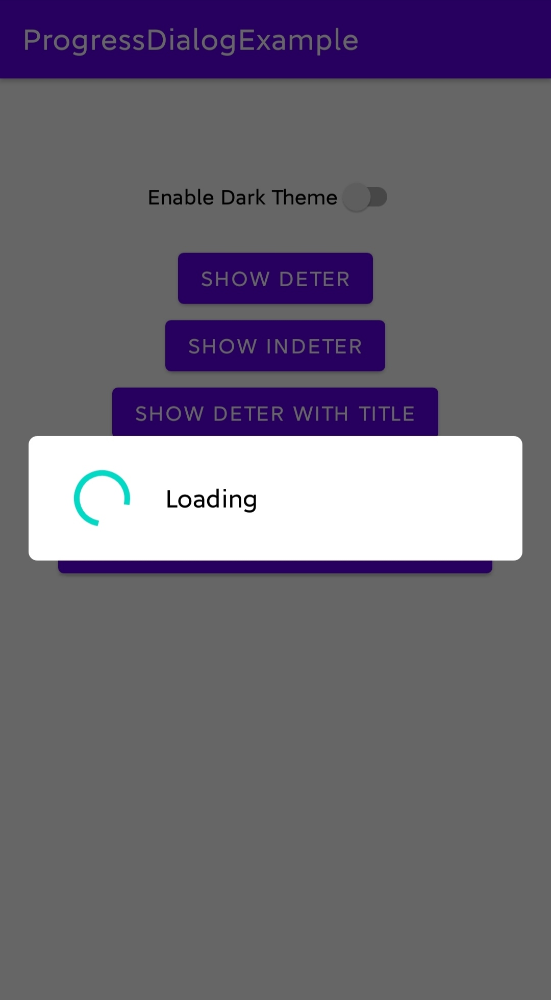

### Indeterminate ProgressDialog without Title (Dark Theme) 	
#### Code:
```java
progressDialog.setTheme(ProgressDialog.THEME_DARK);
progressDialog.show();
```
#### Output:
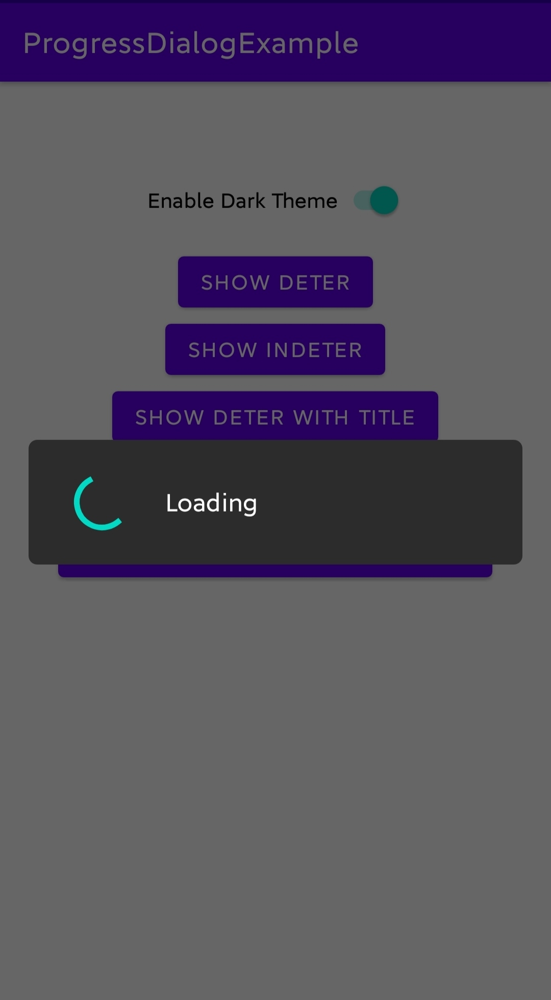

### Determinate ProgressDialog without Title, without ProgressView, with Secondary Progress (Light Theme)
#### Code:
```java
progressDialog.setTheme(ProgressDialog.THEME_LIGHT);
progressDialog.setMode(ProgressDialog.MODE_DETERMINATE);
progressDialog.setProgress(65);
progressDialog.setSecondaryProgress(80);
progressDialog.hideProgressText();
progressDialog.show();
```
#### Output:
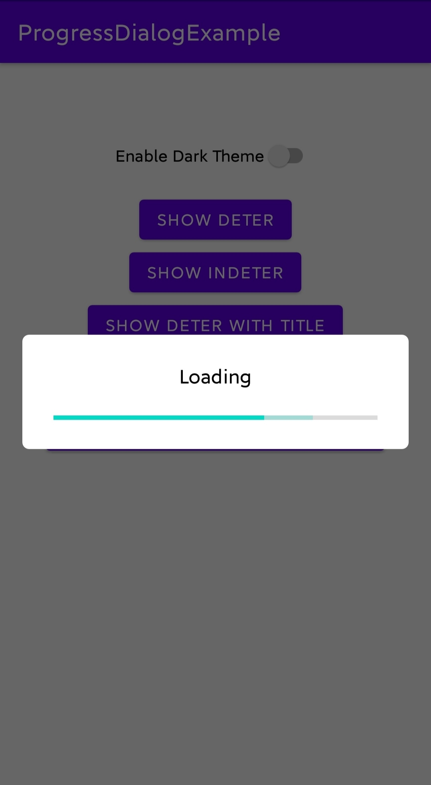

### Determinate ProgressDialog without Title, without ProgressView, with Secondary Progress (Dark Theme)
#### Code:
```java
progressDialog.setTheme(ProgressDialog.THEME_DARK);
progressDialog.setMode(ProgressDialog.MODE_DETERMINATE);
progressDialog.setProgress(65);
progressDialog.setSecondaryProgress(80);
progressDialog.hideProgressText();
progressDialog.show();
```
#### Output:
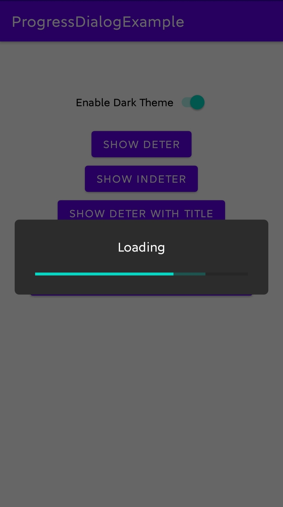

### Determinate ProgressDialog without Title, with ProgressView as Percentage (Light Theme)
#### Code:
```java
progressDialog.setTheme(ProgressDialog.THEME_LIGHT);
progressDialog.setMode(ProgressDialog.MODE_DETERMINATE);
progressDialog.setProgress(65);
progressDialog.show();
```
#### Output:
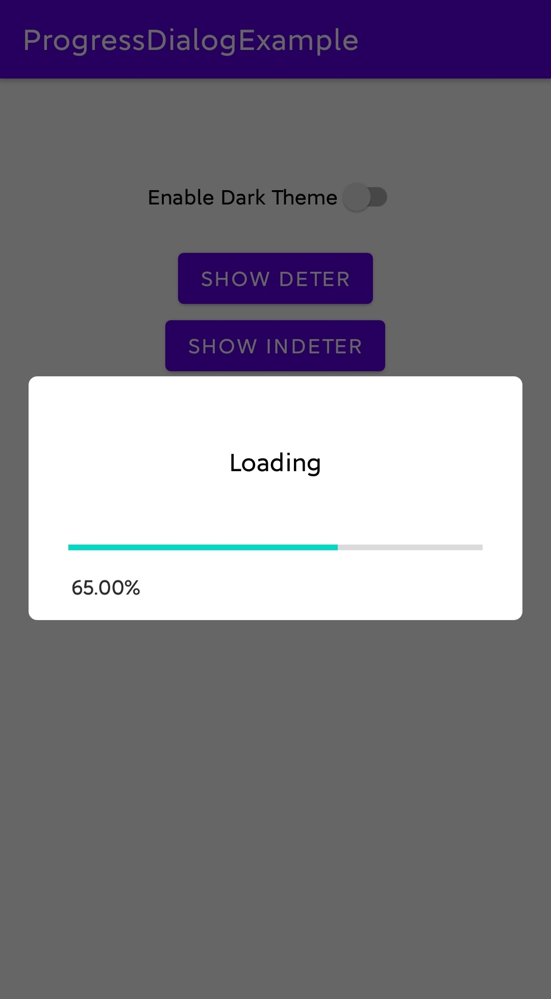

### Determinate ProgressDialog without Title, with ProgressView as Percentage (Dark Theme)
#### Code:
```java
progressDialog.setTheme(ProgressDialog.THEME_DARK);
progressDialog.setMode(ProgressDialog.MODE_DETERMINATE);
progressDialog.setProgress(65);
progressDialog.show();
```
#### Output:
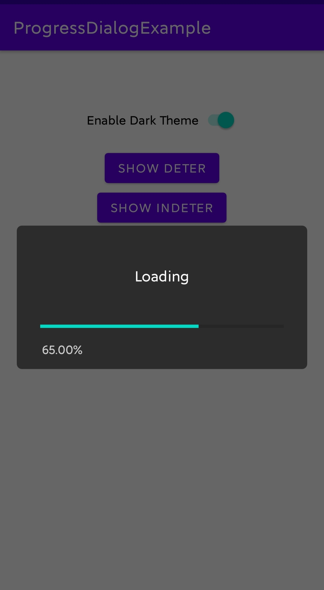

### Indeterminate ProgressDialog with Title (Light Theme)
#### Code:
```java
progressDialog.setTheme(ProgressDialog.THEME_LIGHT);
progressDialog.setMode(ProgressDialog.MODE_INDETERMINATE);
progressDialog.setTitle("Indeterminate");
progressDialog.show();
```
#### Output:
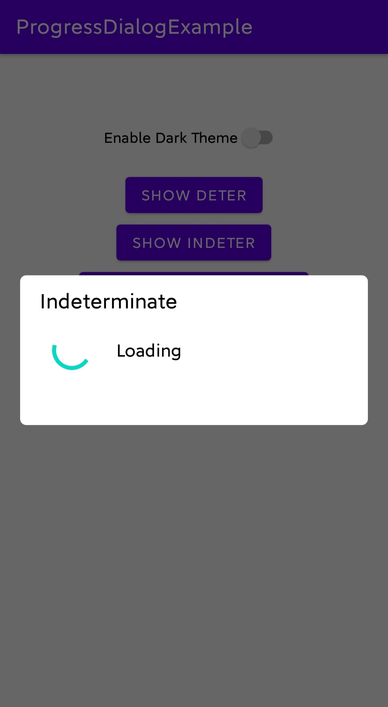

### Indeterminate ProgressDialog with Title (Dark Theme)
#### Code:
```java
progressDialog.setTheme(ProgressDialog.THEME_DARK);
progressDialog.setMode(ProgressDialog.MODE_INDETERMINATE);
progressDialog.setTitle("Indeterminate");
progressDialog.show();
```
#### Output:


### Determinate ProgressDialog with Title, Secondary Progress and ProgressView as Fraction (Light Theme)
#### Code:
```java
progressDialog.setTheme(ProgressDialog.THEME_LIGHT);
progressDialog.setMode(ProgressDialog.MODE_DETERMINATE);
progressDialog.setTitle("Determinate");
progressDialog.setProgress(65);
progressDialog.setSecondaryProgress(80);
progressDialog.showProgressTextAsFraction(true);
progressDialog.show();
```
#### Output:
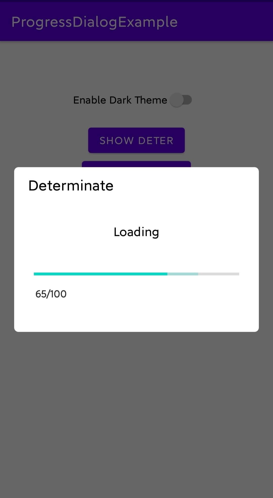

### Determinate ProgressDialog with Title, Secondary Progress and ProgressView as Fraction (Dark Theme)
#### Code:
```java
progressDialog.setTheme(ProgressDialog.THEME_DARK);
progressDialog.setMode(ProgressDialog.MODE_DETERMINATE);
progressDialog.setTitle("Determinate");
progressDialog.setProgress(65);
progressDialog.setSecondaryProgress(80);
progressDialog.showProgressTextAsFraction(true);
progressDialog.show();
```
#### Output:


### Indeterminate ProgressDialog with NegativeButton and Custom OnClickListener for NegativeButton (Light Theme)
##### Note: Enabling NegativeButton will automatically enable TitleView.
#### Code:
```java
progressDialog.setTheme(ProgressDialog.THEME_LIGHT);
progressDialog.setMode(ProgressDialog.MODE_INDETERMINATE);
progressDialog.setNegativeButton("Dismiss","Indeterminate",v -> {
                    Toast.makeText(this,"Custom OnClickListener for Indeterminate",Toast.LENGTH_LONG).show();
                    progressDialog.dismiss();
                });
progressDialog.show();
```
#### Output:
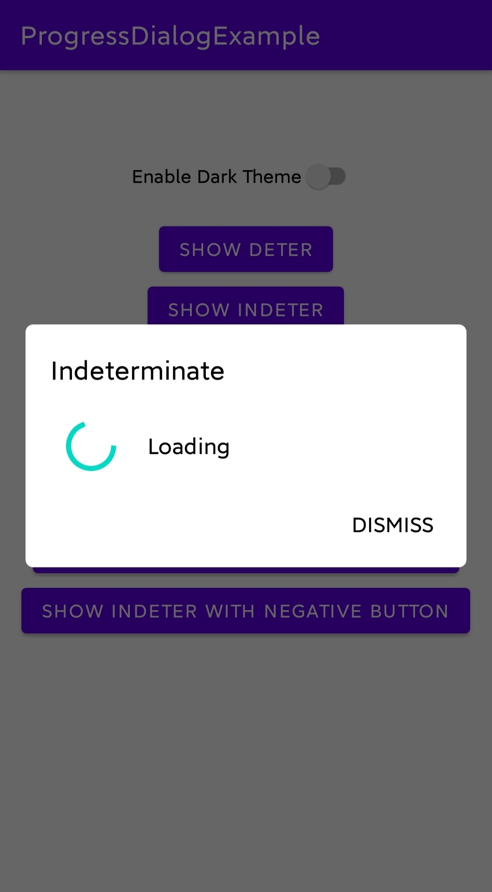

### Indeterminate ProgressDialog with NegativeButton and Custom OnClickListener for NegativeButton (Dark Theme)
##### Note: Enabling NegativeButton will automatically enable TitleView.
#### Code:
```java
progressDialog.setTheme(ProgressDialog.THEME_DARK);
progressDialog.setMode(ProgressDialog.MODE_INDETERMINATE);
progressDialog.setNegativeButton("Dismiss","Indeterminate",v -> {
                    Toast.makeText(this,"Custom OnClickListener for Indeterminate",Toast.LENGTH_LONG).show();
                    progressDialog.dismiss();
                });
progressDialog.show();
```
#### Output:
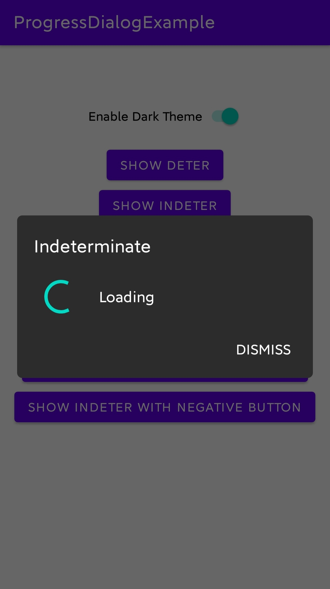

### Determinate ProgressDialog with NegativeButton and Default OnClickListener for NegativeButton (Light Theme)
##### Note: Enabling NegativeButton will automatically enable TitleView.
#### Code:
```java
progressDialog.setTheme(ProgressDialog.THEME_LIGHT);
progressDialog.setMode(ProgressDialog.MODE_DETERMINATE);
progressDialog.setProgress(54);
progressDialog.showProgressTextAsFraction(true);
progressDialog.setNegativeButton("Cancel","Determinate",null);
progressDialog.show();
```
#### Output:
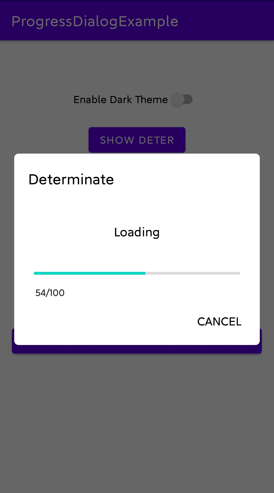

### Determinate ProgressDialog with NegativeButton and Default OnClickListener for NegativeButton (Dark Theme)
##### Note: Enabling NegativeButton will automatically enable TitleView.
#### Code:
```java
progressDialog.setTheme(ProgressDialog.THEME_DARK);
progressDialog.setMode(ProgressDialog.MODE_DETERMINATE);
progressDialog.setProgress(54);
progressDialog.showProgressTextAsFraction(true);
progressDialog.setNegativeButton("Cancel","Determinate",null);
progressDialog.show();
```
#### Output:
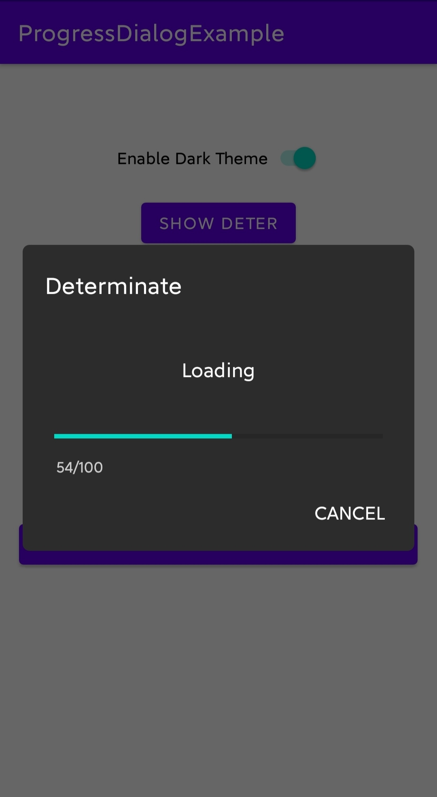
